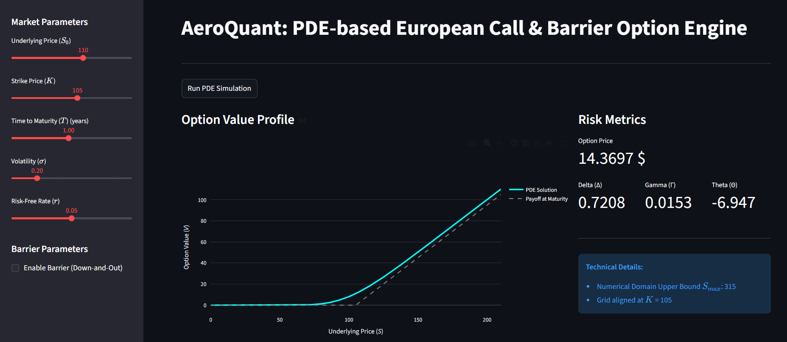
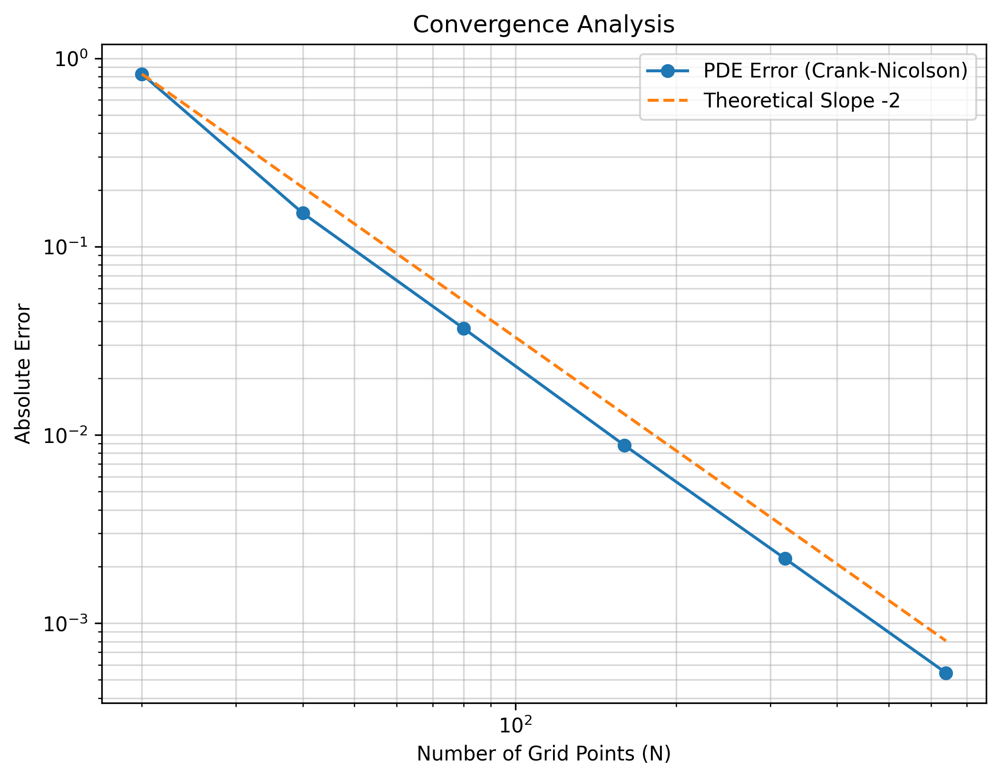
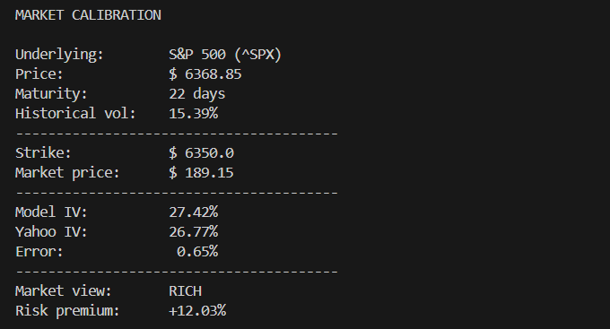
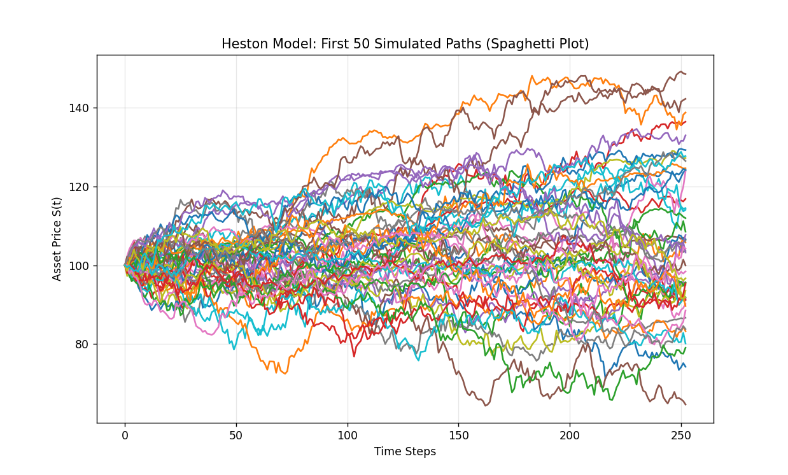

# AeroQuant Engine
**High-Performance Quantitative Framework for Option Pricing & Market Calibration**

> **[LIVE INTERACTIVE DEMO HERE](https://aeroquantengine-tjqsxmmnpcsff2dcp8teud.streamlit.app/)**



AeroQuant is a high-performance numerical engine for pricing vanilla and barrier options. Built on a foundation of Aerospace Engineering numerical principles, the solver utilizes Finite Difference Methods (FDM) to solve the Black-Scholes PDE. Key features include Crank-Nicolson integration with Rannacher stepping to ensure stability and eliminate numerical oscillations, and a dynamic grid alignment for precise strike and barrier handling.


### Black-Scholes PDE
The engine solves the second-order partial differential equation for the option value $V(S, t)$:

$$\frac{\partial V}{\partial t} + \frac{1}{2}\sigma^2 S^2 \frac{\partial^2 V}{\partial S^2} + rS \frac{\partial V}{\partial S} - rV = 0$$

### Heston Model (Stochastic Volatility)
The research module evolves the asset price $S_t$ and its variance $v_t$ using correlated SDEs:

$$dS_t = r S_t dt + \sqrt{v_t} S_t dW_t^1$$
$$dv_t = \kappa(\theta - v_t)dt + \sigma_{\nu} \sqrt{v_t} dW_t^2$$

---

## Key Features
- **PDE Pricing Engine**: A second-order accurate solver for the Black-Scholes PDE using the Crank-Nicolson scheme.
- **Numerical Stability**: Implementation of Rannacher Stepping (initial Implicit Euler steps) to suppress spurious oscillations caused by the non-smooth payoff of European and Barrier options.
- **High-Performance Linear Algebra**: Tridiagonal systems are solved in $O(n)$ time using the Thomas Algorithm, ensuring high-speed execution.
- **Dynamic Grid Mapping**: Adaptive spatial discretization that aligns nodes exactly with the Strike ($K$) and Barrier ($H$) to minimize interpolation errors.
- **Market Calibration**: Real-time Implied Volatility (IV) extraction from S&P 500 options data via a clamped Newton-Raphson optimizer.

---

## Interactive Dashboard
The project includes a Streamlit web application to visualize the option's price, Greeks (Delta, Gamma, Theta), and the impact of barriers in real-time.

**Capabilities:**
- **Dynamic Profiling**: Real-time overlay of the PDE solution vs Payoff at maturity.
- **Live Risk Metrics**: Instant calculation of **Delta (Δ), Gamma (Γ), and Theta (Θ)** directly from the numerical grid.
- **Barrier Simulation**: Toggle Down-and-Out barriers to observe the immediate impact on option value and Greeks.

---

## Scientific Validation & Convergence
The engine has been tested against the analytical Black-Scholes solution. Log-log error analysis confirms a second-order convergence rate $O(\Delta x^2, \Delta t^2)$, demonstrating the mathematical consistency of the Crank-Nicolson implementation.
### Convergence Analysis Results


---

## Market Intelligence
The calibration module fetches live S&P 500 data to compute the **Volatility Risk Premium**, and validate the model:
- **Implied Volatility (IV):** Derived from the PDE model calibrated on market prices.
- **Realized Volatility (RV):** Computed from historical returns to provide a benchmark for "fair" pricing.

### Calibration Case Study: S&P 500 (^SPX)


---

## Research & Development
The repository includes a research/ directory for experimental models and benchmarking:
- **Heston Stochastic Volatility (Monte Carlo)**: A framework to account for the "volatility smile" and leverage effects, which constant-volatility PDE models cannot capture.



- **Hybrid Numerical Scheme**: To evolve the variance process, the engine utilizes a Runge-Kutta 4 (RK4) integration for the deterministic mean-reversion drift, combined with a Milstein scheme for the stochastic diffusion.
- **Variance Reduction**: Implements Antithetic Variates to significantly reduce the standard error of the Monte Carlo estimates, ensuring faster convergence.
- **Leverage Effect**: Simulates the correlation (ρ) between asset returns and volatility, providing a more realistic representation of market dynamics

Note: The Heston module serves as a stochastic research framework. While the PDE engine is calibrated on live market data, the Heston engine allows for "What-if" analysis of stochastic volatility regimes and leverage effects ($\rho$) that exceed the constant-volatility assumptions of the standard Black-Scholes model.

---

## Installation & Usage
To run the AeroQuant Engine locally, follow these steps:
```bash
# 1. Clone the repository and enter the directory
git clone [https://github.com/giuliorss04/AeroQuant_Engine.git]
cd AeroQuant_Engine

# 2. Set up a virtual environment and install dependencies
python -m venv venv
# Activate on Windows: .\venv\Scripts\Activate.ps1 | On macOS/Linux: source venv/bin/activate
pip install -r requirements.txt

# 3. Execution Commands
# Launch the Interactive Dashboard
streamlit run app.py

# Run Live Market Calibration (S&P 500)
python -m scripts.calibrate

# Run PDE Convergence Analysis (Scientific Validation)
python -m tests.convergence_test

# Run Heston Model Research & Monte Carlo Convergence
python -m research.heston_benchmark