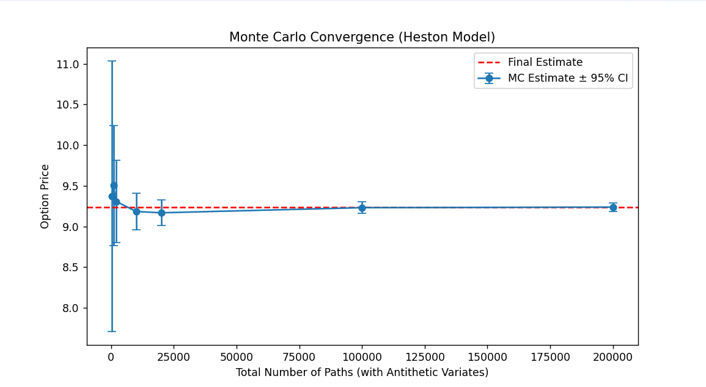

# AeroQuant Engine
**Numerical Option Pricing via PDE Methods & Stochastic Volatility Simulation**

> **[Live Interactive Demo](https://aeroquantengine-tjqsxmmnpcsff2dcp8teud.streamlit.app/)**


AeroQuant Engine is a numerical framework for pricing European vanilla and 
barrier options via finite difference methods (FDM), complemented by a 
Monte Carlo research module for stochastic volatility simulation under the 
Heston model.

The project originates from a direct methodological parallel: the 
Black-Scholes PDE is a convection-diffusion equation of the same class 
routinely solved in computational fluid dynamics and structural mechanics. 
This background informed the choice of numerical schemes (Crank-Nicolson 
time integration, Rannacher stepping for non-smooth initial conditions, and 
Thomas algorithm for tridiagonal linear systems) all standard tools in 
engineering numerics, here applied to derivatives pricing.

---

## Mathematical Framework

### Black-Scholes PDE
The engine solves the following second-order parabolic PDE for the option 
value $V(S, t)$, backward in time from maturity $T$ to $t = 0$:

$$\frac{\partial V}{\partial t} + \frac{1}{2}\sigma^2 S^2\frac{\partial^2 V}{\partial S^2} + (r-q)S \frac{\partial V}{\partial S} - rV = 0$$

where $q \geq 0$ is the continuous dividend yield. Setting $q = 0$ recovers the standard Black-Scholes equation. The risk-neutral drift becomes $(r-q)S$ while the discount factor remains $e^{-rT}$, consistent with the no-arbitrage forward price $F = S_0 e^{(r-q)T}$.

with terminal condition $V(S, T) = \max(S - K, 0)$ for a European call, 
and Dirichlet boundary condition $V(H, t) = 0$ at the barrier $H$ for 
down-and-out options.

### Heston Stochastic Volatility Model
The research module simulates the joint dynamics of asset price $S_t$ and 
instantaneous variance $v_t$ under the risk-neutral measure:

$$dS_t = r S_t \, dt + \sqrt{v_t} \, S_t \, dW_t^1$$
$$dv_t = \kappa(\theta - v_t)\, dt + \sigma_v \sqrt{v_t} \, dW_t^2, 
\qquad d\langle W^1, W^2 \rangle_t = \rho \, dt$$

where $\kappa$ is the mean-reversion speed, $\theta$ the long-run variance, 
$\sigma_v$ the volatility of variance, and $\rho$ the leverage correlation.

---

## Numerical Methods

### PDE Solver

**Crank-Nicolson Scheme**  
The Black-Scholes PDE is discretised on a uniform grid in $\log S$ 
using second-order central differences in space and the Crank-Nicolson 
(CN) scheme in time, yielding a tridiagonal system at each time step:

$$A \mathbf{v}^{n+1} = B \mathbf{v}^n$$

where $A$ and $B$ encode the implicit and explicit operators respectively. 
The scheme is second-order accurate in both space and time: 
$O(\Delta S^2, \Delta t^2)$.

**Rannacher Stepping**  
The discontinuity in $\partial V / \partial S$ at $S = K$ at maturity 
degrades CN accuracy and introduces spurious oscillations. Following 
Rannacher, the first two time steps are replaced by two 
fully-implicit (backward Euler) half-steps of size $\Delta t / 2$ each, 
restoring second-order convergence globally while suppressing oscillations.

**Thomas Algorithm**  
The tridiagonal systems arising at each CN step are solved in $O(n)$ 
operations via the Thomas algorithm (tridiagonal matrix algorithm), 
implemented in `core/solvers.py`.

**Dynamic Grid Alignment**  
The spatial grid is constructed so that the strike $K$ and barrier $H$ 
coincide exactly with grid nodes, eliminating interpolation error at the 
points of greatest sensitivity.

**Right Boundary Condition**  
At $S_{\max}$, a linear boundary condition $\partial^2 V / \partial S^2 = 0$ 
is enforced by ghost-node elimination, consistent with the asymptotic 
behaviour of a call option for large $S$.

### Monte Carlo Simulator (Heston)

**Hybrid RK4–Milstein Discretisation**  
The variance process is discretised using a hybrid scheme: the 
deterministic mean-reversion drift $\kappa(\theta - v)$ is integrated with 
a classical Runge-Kutta 4 (RK4) step, while the stochastic diffusion term 
is handled by the Milstein correction:

$$v_{t+\Delta t} = v_t + \underbrace{\frac{\Delta t}{6}(k_1 + 2k_2 + 2k_3 + k_4)}_{\text{RK4 drift}} + \sigma_v\sqrt{v_t}\,\Delta W_t^2 + \underbrace{\frac{\sigma_v^2}{4}\left[(\Delta W_t^2)^2 - \Delta t\right]}_{\text{Milstein correction}}$$

The Milstein discretisation achieves strong order 1.0 in $O\Delta t$ for the variance process; the RK4 component improves accuracy of the deterministic drift at negligible additional cost without altering the convergence order of the stochastic term.

The asset price is updated via the exact log-Euler scheme to prevent 
negative prices:

$$S_{t+\Delta t} = S_t \exp\left[\left(r - \frac{1}{2}v_t\right) \Delta t + \sqrt{v_t} \Delta W_t^1\right]$$

**Variance Reduction: Antithetic Variates**  
For each set of $n$ random draws $(\mathbf{z}_1, \mathbf{z}_2)$, the 
simulator also evaluates the antithetic path $(-\mathbf{z}_1, -\mathbf{z}_2)$, 
reducing estimator variance by exploiting the negative correlation between original and antithetic payoffs, at negligible additional computational cost.

---

## Convergence Validation

The PDE solver is benchmarked against the analytical Black-Scholes price. 
Log-log error analysis over grids ranging from $20 \times 40$ to 
$640 \times 1280$ confirms second-order convergence:
```
Grid   20x40    | Error: 8.26e-01 | Conv. rate: nan
Grid   40x80    | Error: 1.51e-01 | Conv. rate: 2.45
Grid   80x160   | Error: 3.68e-02 | Conv. rate: 2.03
Grid  160x320   | Error: 8.82e-03 | Conv. rate: 2.06
Grid  320x640   | Error: 2.20e-03 | Conv. rate: 2.00
Grid  640x1280  | Error: 5.45e-04 | Conv. rate: 2.01

```


The measured convergence rate of **~2.00** confirms the theoretical 
$O(\Delta x^2, \Delta t^2)$ accuracy of the Crank-Nicolson + Rannacher 
implementation.

---

## Market Calibration

The calibration module (`scripts/calibrate.py`) extracts the implied 
volatility (IV) from live S&P 500 option prices by inverting the PDE pricer 
via Newton-Raphson iteration with numerical vega:

$$\sigma_{n+1} = \sigma_n - \frac{V_{\text{PDE}}(\sigma_n) - V_{\text{market}}}{\mathcal{V}(\sigma_n)}, \qquad \mathcal{V}\approx\frac{V_{\text{PDE}}(\sigma + 0.01) - V_{\text{PDE}}(\sigma)}{0.01}$$

The IV is compared against the 30-day realised volatility (RV) computed 
from historical log-returns to estimate the **Volatility Risk Premium** 
(VRP = IV − RV). Market prices are sourced from Yahoo Finance; mid-prices 
$\frac{\text{bid} + \text{ask}}{2}$ are used to avoid stale last-price bias.


---

## Interactive Dashboard

A Streamlit application (`app.py`) provides real-time visualisation of 
the PDE solution:

- **PDE Solution vs Payoff**: overlay of $V(S, t=0)$ and the terminal 
  payoff $\max(S-K, 0)$
- **Greeks**: Delta ($\Delta$), Gamma ($\Gamma$), and Theta ($\Theta$) 
  computed directly from the numerical grid via finite differences
- **Barrier Toggle**: real-time comparison of vanilla vs down-and-out 
  barrier option pricing

---

## Research Module: Heston Stochastic Volatility

The `research/` directory contains an independent simulation and 
convergence framework 
for the Heston model, motivated by the limitations of the constant-volatility 
Black-Scholes assumption:

- Black-Scholes implies a flat implied volatility surface; real markets 
  exhibit a **volatility smile/skew**
- Heston models the **leverage effect** ($\rho < 0$): negative correlation 
  between asset returns and volatility, consistently observed in equity markets
- The Monte Carlo convergence test quantifies estimator variance as a 
  function of path count, with 95% confidence intervals:




> This module is a research and benchmarking tool. It is not calibrated 
> to live market data; its purpose is to illustrate the structural 
> differences between constant- and stochastic-volatility pricing frameworks.
>
>A fixed random seed (`numpy.random.seed(42)`) is used throughout for reproducibility of reported results.

---

## Project Structure
```
AeroQuant_Engine/
├── core/
│   └── solvers.py              # Thomas algorithm (tridiagonal solver)
├── models/
│   └── black_scholes_pde.py    # CN + Rannacher PDE solver
├── scripts/
│   └── calibrate.py            # IV extraction via Newton-Raphson
├── data/
│   └── market_data.py          # Yahoo Finance data pipeline (SPX)
├── tests/
│   └── convergence_test.py     # Log-log convergence analysis
├── research/
│   └── heston_simulation.py    # Heston MC simulation & convergence
├── app.py                      # Streamlit interactive dashboard
└── requirements.txt
```

---

## Installation & Usage
```bash
# 1. Clone the repository
git clone https://github.com/giuliorss04/AeroQuant_Engine.git
cd AeroQuant_Engine

# 2. Create and activate a virtual environment
python -m venv venv
.\venv\Scripts\Activate.ps1      # Windows
source venv/bin/activate          # macOS/Linux

pip install -r requirements.txt

# 3. Run modules
streamlit run app.py                        # Interactive dashboard
python -m scripts.calibrate                 # Live market calibration (SPX)
python -m tests.convergence_test            # PDE convergence analysis
python -m research.heston_simulation        # Heston MC simulation
```

---

## Dependencies

| Package | Purpose |
|---|---|
| `numpy`      | Numerical arrays and linear algebra |
| `scipy`      | Normal CDF for analytical benchmark |
| `matplotlib` | Convergence and simulation plots |
| `yfinance`   | Live SPX options data |
| `streamlit`  | Interactive web dashboard |
| `pandas`     | Data manipulation for market data pipeline        |
| `plotly`     | Interactive charts in the Streamlit dashboard     |
| `altair`     | Declarative visualisation layer (pinned `<5` for Streamlit compatibility) |